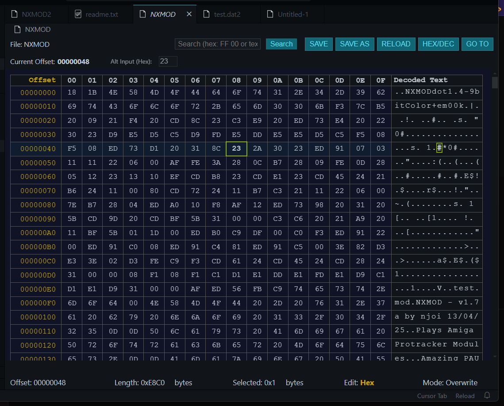

# VS Code Hex Editor

A powerful hex editor extension for Visual Studio Code that allows you to view and edit binary files directly within your favorite editor.

## Features

- **View binary files** in a traditional hex editor layout
- **Edit in Hex or Text mode** - modify bytes directly in either representation
- **Overwrite or Insert mode** - choose between replacing bytes or inserting new ones
- **Search functionality** - find hex patterns or text strings in your binary files
- **Go to offset** - jump directly to a specific position in the file
- **Toggle between hex and decimal offsets** - display offsets in your preferred format
- **Infinite scrolling** with virtualization for handling large files
- **Zero-byte file support** - create and edit new binary files from scratch

## Usage

1. Open any binary file in VS Code
2. Right-click the file tab and select "Open With..." or use the command palette
3. Choose "Hex Editor" from the list of available editors
4. Start viewing and editing your binary files!

## Keyboard Shortcuts

- **Ctrl+S**: Save file
- **Ctrl+R**: Reload file
- **Ctrl+O**: Toggle offset display (Hex/Dec)
- **Ctrl+I**: Toggle insert/overwrite mode
- **Ctrl+F**: Search
- **Ctrl+A**: Select all

## Navigation

- Use arrow keys to navigate through the file
- Click on any byte in the hex or text area to select it
- Use Tab/Shift+Tab to move forward/backward
- Hold Shift with arrow keys to select ranges

## Editing

- In Hex view: Type any hex digit (0-9, A-F) to edit the current byte
- In Text view: Type any printable ASCII character to edit the current byte
- Use Backspace and Delete keys in Insert mode to remove bytes
- Use the "Alt Input" field at the top for precise hex editing

## Support This Project

If you find this extension useful, please consider supporting its development:

Your support helps maintain and improve this extension with new features and bug fixes.

## Issues and Feedback

Found a bug or have a feature request? Please [open an issue](https://github.com/em00k/vscode-hexeditor/issues) on our GitHub repository.

## License

This extension is licensed under the MIT License. See the LICENSE file for details. 